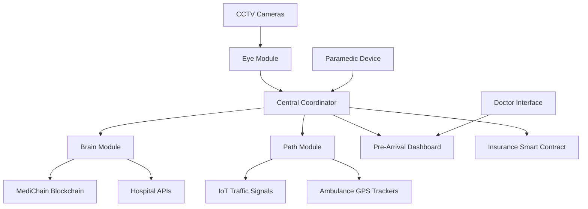
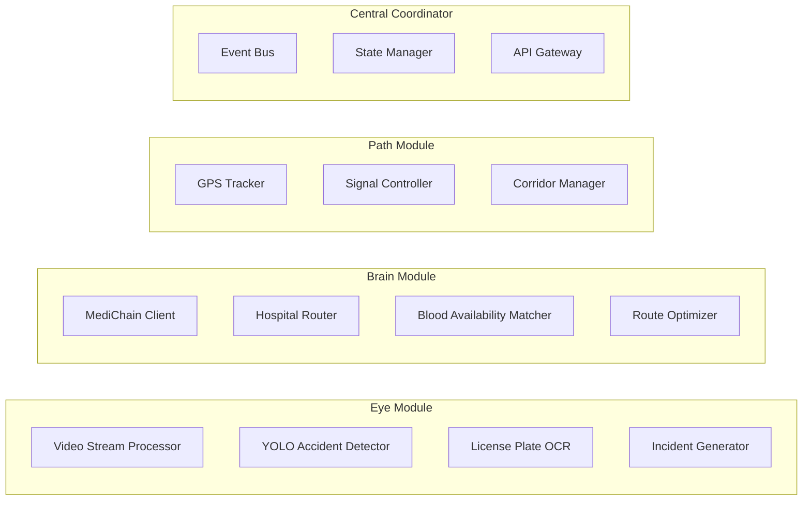

# Design Document: LifeLink Emergency Response System

## Overview

LifeLink is a distributed emergency response coordination system that eliminates human-induced delays in accident response through automated detection, intelligent routing, and proactive hospital preparation. The system operates as three interconnected modules:

1. **Eye Module**: AI-powered accident detection using YOLOv8 computer vision on CCTV feeds
2. **Brain Module**: Medical data retrieval via blockchain and intelligent hospital routing
3. **Path Module**: Real-time traffic signal control for ambulance priority

The system is designed as a Clinical Decision Support System (CDSS) that assists human decision-makers rather than replacing them. All critical decisions (treatment plans, surgical interventions) remain with medical professionals, while LifeLink handles coordination, data aggregation, and logistics automation.

### Design Principles

- **Zero-delay coordination**: Automate time-critical coordination tasks
- **Fail-safe operation**: Graceful degradation when components fail
- **Privacy-first**: Emergency-only access with complete audit trails
- **Human-in-the-loop**: Support decisions, don't make them
- **India-context optimization**: Multi-language, diverse infrastructure

## Architecture

### System Context Diagram



### Component Architecture



### Technology Stack

- **Accident Detection**: Python 3.10+, YOLOv8, OpenCV, EasyOCR
- **Backend Services**: FastAPI, PostgreSQL, Redis
- **Blockchain**: Polygon (Layer 2), IPFS, Web3.py
- **Frontend**: Flutter (mobile + web), WebSocket for real-time updates
- **Maps & Routing**: Mapbox API, OSRM (Open Source Routing Machine)
- **Infrastructure**: Docker, Kubernetes (for scaling), AWS/GCP

## Components and Interfaces

### 1. Eye Module - Accident Detection System

**Responsibilities:**
- Process CCTV video streams in real-time
- Detect accident events using YOLOv8 object detection
- Extract license plates using OCR
- Generate incident records with GPS and timestamp

**Core Components:**

#### VideoStreamProcessor
```python
class VideoStreamProcessor:
    """Manages CCTV camera connections and frame extraction"""
    
    def connect_camera(camera_id: str, rtsp_url: str) -> CameraConnection
    def get_frame(camera_id: str) -> Frame
    def disconnect_camera(camera_id: str) -> None
```

#### AccidentDetector
```python
class AccidentDetector:
    """YOLOv8-based accident detection"""
    
    def __init__(model_path: str, confidence_threshold: float)
    def detect_accident(frame: Frame) -> Optional[AccidentEvent]
    def classify_severity(event: AccidentEvent) -> SeverityLevel
```

**AccidentEvent Structure:**
```python
@dataclass
class AccidentEvent:
    incident_id: str
    timestamp: datetime
    gps_location: GPSCoordinate
    camera_id: str
    severity: SeverityLevel  # CRITICAL, MODERATE, MINOR
    vehicle_count: int
    frame_snapshot: bytes
    confidence_score: float
```

#### LicensePlateExtractor
```python
class LicensePlateExtractor:
    """OCR-based license plate extraction"""
    
    def extract_plates(frame: Frame, bounding_boxes: List[BBox]) -> List[str]
    def validate_plate_format(plate: str) -> bool
```

**Interfaces:**

```python
# Event published to Central Coordinator
class AccidentDetectedEvent:
    incident_id: str
    location: GPSCoordinate
    timestamp: datetime
    severity: SeverityLevel
    license_plates: List[str]
    snapshot_url: str
```

### 2. Brain Module - Medical Data & Hospital Routing

**Responsibilities:**
- Query MediChain for patient medical profiles
- Match blood requirements with hospital availability
- Calculate optimal hospital routing considering multiple factors
- Coordinate with insurance smart contracts

**Core Components:**

#### MediChainClient
```python
class MediChainClient:
    """Blockchain interface for medical records"""
    
    def __init__(polygon_rpc_url: str, contract_address: str)
    def get_emergency_profile(license_plate: str) -> Optional[EmergencyMedicalProfile]
    def log_access(incident_id: str, accessed_by: str) -> TransactionHash
    def verify_access_permission(incident_id: str) -> bool
```

**EmergencyMedicalProfile Structure:**
```python
@dataclass
class EmergencyMedicalProfile:
    patient_id: str
    blood_group: BloodGroup
    allergies: List[str]
    chronic_conditions: List[str]
    current_medications: List[str]
    emergency_contact: str
    insurance_policy_id: Optional[str]
```

#### HospitalRouter
```python
class HospitalRouter:
    """Intelligent hospital selection"""
    
    def find_optimal_hospital(
        location: GPSCoordinate,
        medical_profile: Optional[EmergencyMedicalProfile],
        severity: SeverityLevel
    ) -> HospitalSelection
    
    def get_hospitals_in_radius(location: GPSCoordinate, radius_km: float) -> List[Hospital]
    def calculate_eta(from_location: GPSCoordinate, to_hospital: Hospital) -> timedelta
```

**Hospital Structure:**
```python
@dataclass
class Hospital:
    hospital_id: str
    name: str
    location: GPSCoordinate
    trauma_capability: TraumaLevel  
    blood_inventory: Dict[BloodGroup, int]
    current_capacity: int
    max_capacity: int
    specializations: List[str]
```

**HospitalSelection Structure:**
```python
@dataclass
class HospitalSelection:
    hospital: Hospital
    eta_minutes: int
    selection_reason: str  # "Blood available + shortest ETA"
    alternative_hospitals: List[Hospital]
```

#### BloodAvailabilityMatcher
```python
class BloodAvailabilityMatcher:
    """Match patient blood needs with hospital inventory"""
    
    def check_blood_availability(
        blood_group: BloodGroup,
        hospitals: List[Hospital]
    ) -> List[Tuple[Hospital, int]]  # Hospital and units available
    
    def get_compatible_blood_types(blood_group: BloodGroup) -> List[BloodGroup]
```

**Interfaces:**

```python
# Request to Hospital API
class PreArrivalNotification:
    incident_id: str
    patient_profile: EmergencyMedicalProfile
    eta_minutes: int
    severity: SeverityLevel
    ambulance_id: str

# Response from Hospital API
class HospitalAcknowledgment:
    hospital_id: str
    accepted: bool
    preparation_status: str
    assigned_doctor_id: Optional[str]
```

### 3. Path Module - Green Corridor Automation

**Responsibilities:**
- Track ambulance GPS location in real-time
- Predict ambulance arrival at traffic signals
- Send IoT commands to control traffic lights
- Coordinate multiple simultaneous ambulance routes

**Core Components:**

#### AmbulanceTracker
```python
class AmbulanceTracker:
    """Real-time ambulance GPS tracking"""
    
    def start_tracking(ambulance_id: str, incident_id: str) -> None
    def get_current_location(ambulance_id: str) -> GPSCoordinate
    def get_route_progress(ambulance_id: str) -> RouteProgress
    def stop_tracking(ambulance_id: str) -> None
```

#### SignalController
```python
class SignalController:
    """IoT traffic signal control"""
    
    def send_green_command(signal_id: str, lane: int) -> bool
    def send_red_command(signal_id: str, lanes: List[int]) -> bool
    def restore_normal_timing(signal_id: str) -> bool
    def get_signal_status(signal_id: str) -> SignalStatus
```

#### GreenCorridorManager
```python
class GreenCorridorManager:
    """Coordinate traffic signals along ambulance route"""
    
    def create_corridor(
        ambulance_id: str,
        route: List[GPSCoordinate],
        signals: List[TrafficSignal]
    ) -> CorridorID
    
    def update_corridor(corridor_id: CorridorID, current_location: GPSCoordinate) -> None
    def close_corridor(corridor_id: CorridorID) -> None
    def predict_signal_arrival(ambulance_location: GPSCoordinate, signal: TrafficSignal) -> timedelta
```

**TrafficSignal Structure:**
```python
@dataclass
class TrafficSignal:
    signal_id: str
    location: GPSCoordinate
    iot_device_id: str
    lanes: List[LaneConfig]
    normal_timing: Dict[int, int]  # lane -> green duration seconds
```

**Interfaces:**

```python
# MQTT message to IoT signal controller
class SignalCommand:
    signal_id: str
    command_type: str  # "GREEN", "RED", "RESTORE"
    target_lanes: List[int]
    duration_seconds: int
    priority: int
    incident_id: str
```

### 4. Central Coordinator

**Responsibilities:**
- Orchestrate communication between modules
- Maintain incident state machine
- Provide unified API for external interfaces
- Handle event-driven workflows

**Core Components:**

#### EventBus
```python
class EventBus:
    """Pub-sub event system for inter-module communication"""
    
    def publish(event: Event) -> None
    def subscribe(event_type: str, handler: Callable) -> SubscriptionID
    def unsubscribe(subscription_id: SubscriptionID) -> None
```

#### IncidentStateMachine
```python
class IncidentStateMachine:
    """Track incident lifecycle"""
    
    def create_incident(event: AccidentDetectedEvent) -> IncidentID
    def transition(incident_id: IncidentID, new_state: IncidentState) -> None
    def get_state(incident_id: IncidentID) -> IncidentState
    def get_incident_data(incident_id: IncidentID) -> IncidentRecord
```

**IncidentState Enum:**
```python
class IncidentState(Enum):
    DETECTED = "detected"
    AMBULANCE_DISPATCHED = "ambulance_dispatched"
    PATIENT_IDENTIFIED = "patient_identified"
    HOSPITAL_SELECTED = "hospital_selected"
    EN_ROUTE = "en_route"
    ARRIVED = "arrived"
    RESOLVED = "resolved"
```

**IncidentRecord Structure:**
```python
@dataclass
class IncidentRecord:
    incident_id: str
    state: IncidentState
    detection_time: datetime
    location: GPSCoordinate
    severity: SeverityLevel
    license_plates: List[str]
    patient_profiles: List[EmergencyMedicalProfile]
    selected_hospital: Optional[Hospital]
    ambulance_id: Optional[str]
    timeline: List[StateTransition]
```

### 5. Pre-Arrival Dashboard

**Responsibilities:**
- Display patient medical data to hospital staff
- Stream live vitals from ambulance
- Show ETA and ambulance location
- Provide operating theater preparation alerts

**Core Components:**

#### DashboardAPI
```python
class DashboardAPI:
    """WebSocket API for real-time dashboard updates"""
    
    def connect_hospital(hospital_id: str, auth_token: str) -> WebSocketConnection
    def send_patient_data(connection: WebSocketConnection, data: PatientDashboardData) -> None
    def stream_vitals(connection: WebSocketConnection, vitals: VitalSigns) -> None
```

**PatientDashboardData Structure:**
```python
@dataclass
class PatientDashboardData:
    incident_id: str
    patient_profile: EmergencyMedicalProfile
    severity: SeverityLevel
    eta_minutes: int
    ambulance_location: GPSCoordinate
    live_vitals: Optional[VitalSigns]
    preparation_alerts: List[str]
```

**VitalSigns Structure:**
```python
@dataclass
class VitalSigns:
    timestamp: datetime
    heart_rate: int  # bpm
    blood_pressure_systolic: int  # mmHg
    blood_pressure_diastolic: int  # mmHg
    oxygen_saturation: float  # percentage
    respiratory_rate: int  # breaths per minute
    temperature: float  # celsius
    critical_flags: List[str]
```

### 6. Insurance Smart Contract

**Responsibilities:**
- Verify accident through AI detection
- Lock emergency funds from insurance policy
- Display payment status to hospital
- Release funds upon treatment completion

**Smart Contract Interface (Solidity):**

```solidity
interface IEmergencyInsurance {
    function lockEmergencyFunds(
        string memory incidentId,
        string memory policyId,
        uint256 estimatedAmount
    ) external returns (bool);
    
    function verifyPaymentStatus(string memory incidentId) external view returns (PaymentStatus);
    
    function releaseFunds(
        string memory incidentId,
        address hospitalAddress,
        uint256 actualAmount
    ) external returns (bool);
    
    function getAccessLog(string memory incidentId) external view returns (AccessLog[] memory);
}
```

**Python Client:**
```python
class InsuranceSmartContract:
    """Web3 interface for insurance smart contract"""
    
    def __init__(contract_address: str, private_key: str)
    def lock_funds(incident_id: str, policy_id: str, estimated_amount: int) -> TransactionHash
    def check_payment_status(incident_id: str) -> PaymentStatus
    def release_funds(incident_id: str, hospital_address: str, actual_amount: int) -> TransactionHash
```

## Data Models

### Core Data Types

```python
from enum import Enum
from dataclasses import dataclass
from datetime import datetime
from typing import List, Optional

@dataclass
class GPSCoordinate:
    latitude: float
    longitude: float
    accuracy_meters: float

class BloodGroup(Enum):
    A_POSITIVE = "A+"
    A_NEGATIVE = "A-"
    B_POSITIVE = "B+"
    B_NEGATIVE = "B-"
    AB_POSITIVE = "AB+"
    AB_NEGATIVE = "AB-"
    O_POSITIVE = "O+"
    O_NEGATIVE = "O-"

class SeverityLevel(Enum):
    CRITICAL = "critical"
    MODERATE = "moderate"
    MINOR = "minor"

class TraumaLevel(Enum):
    LEVEL_1 = "level_1"  # Comprehensive trauma center
    LEVEL_2 = "level_2"  # Specialized trauma care
    LEVEL_3 = "level_3"  # Basic emergency care

class PaymentStatus(Enum):
    PENDING = "pending"
    LOCKED = "locked"
    RELEASED = "released"
    FAILED = "failed"
```

### Database Schema

**PostgreSQL Tables:**

```sql
-- Incidents table
CREATE TABLE incidents (
    incident_id VARCHAR(36) PRIMARY KEY,
    detection_time TIMESTAMP NOT NULL,
    location_lat DECIMAL(10, 8) NOT NULL,
    location_lon DECIMAL(11, 8) NOT NULL,
    severity VARCHAR(20) NOT NULL,
    state VARCHAR(50) NOT NULL,
    camera_id VARCHAR(50),
    snapshot_url TEXT,
    created_at TIMESTAMP DEFAULT NOW()
);

-- License plates associated with incidents
CREATE TABLE incident_plates (
    id SERIAL PRIMARY KEY,
    incident_id VARCHAR(36) REFERENCES incidents(incident_id),
    license_plate VARCHAR(20) NOT NULL,
    extracted_at TIMESTAMP DEFAULT NOW()
);

-- Ambulance assignments
CREATE TABLE ambulance_assignments (
    id SERIAL PRIMARY KEY,
    incident_id VARCHAR(36) REFERENCES incidents(incident_id),
    ambulance_id VARCHAR(50) NOT NULL,
    dispatched_at TIMESTAMP NOT NULL,
    arrived_at TIMESTAMP,
    status VARCHAR(20) NOT NULL
);

-- Hospital selections
CREATE TABLE hospital_selections (
    id SERIAL PRIMARY KEY,
    incident_id VARCHAR(36) REFERENCES incidents(incident_id),
    hospital_id VARCHAR(50) NOT NULL,
    selection_reason TEXT,
    eta_minutes INT,
    selected_at TIMESTAMP DEFAULT NOW()
);

-- Access logs for audit trail
CREATE TABLE access_logs (
    id SERIAL PRIMARY KEY,
    incident_id VARCHAR(36) REFERENCES incidents(incident_id),
    accessed_by VARCHAR(100) NOT NULL,
    access_type VARCHAR(50) NOT NULL,
    accessed_at TIMESTAMP DEFAULT NOW(),
    ip_address INET
);

-- Hospitals registry
CREATE TABLE hospitals (
    hospital_id VARCHAR(50) PRIMARY KEY,
    name VARCHAR(200) NOT NULL,
    location_lat DECIMAL(10, 8) NOT NULL,
    location_lon DECIMAL(11, 8) NOT NULL,
    trauma_capability VARCHAR(20) NOT NULL,
    current_capacity INT NOT NULL,
    max_capacity INT NOT NULL,
    contact_number VARCHAR(20),
    updated_at TIMESTAMP DEFAULT NOW()
);

-- Blood inventory
CREATE TABLE blood_inventory (
    id SERIAL PRIMARY KEY,
    hospital_id VARCHAR(50) REFERENCES hospitals(hospital_id),
    blood_group VARCHAR(5) NOT NULL,
    units_available INT NOT NULL,
    last_updated TIMESTAMP DEFAULT NOW(),
    UNIQUE(hospital_id, blood_group)
);

-- Traffic signals registry
CREATE TABLE traffic_signals (
    signal_id VARCHAR(50) PRIMARY KEY,
    location_lat DECIMAL(10, 8) NOT NULL,
    location_lon DECIMAL(11, 8) NOT NULL,
    iot_device_id VARCHAR(100) NOT NULL,
    status VARCHAR(20) NOT NULL,
    last_command_at TIMESTAMP
);
```

### Blockchain Data Structures

**MediChain Storage (IPFS + Polygon):**

```json
{
  "patient_id": "hash_of_license_plate",
  "emergency_profile": {
    "blood_group": "A+",
    "allergies": ["penicillin", "latex"],
    "chronic_conditions": ["diabetes_type_2", "hypertension"],
    "current_medications": ["metformin", "lisinopril"],
    "emergency_contact": "+91XXXXXXXXXX",
    "insurance_policy_id": "POL123456789"
  },
  "ipfs_hash": "QmXxx...",
  "encrypted": true,
  "last_updated": "2024-01-15T10:30:00Z"
}
```

**Smart Contract Events:**

```solidity
event FundsLocked(
    string indexed incidentId,
    string policyId,
    uint256 amount,
    uint256 timestamp
);

event FundsReleased(
    string indexed incidentId,
    address hospitalAddress,
    uint256 amount,
    uint256 timestamp
);

event AccessGranted(
    string indexed incidentId,
    address accessor,
    uint256 timestamp
);
```

## Correctness Properties

